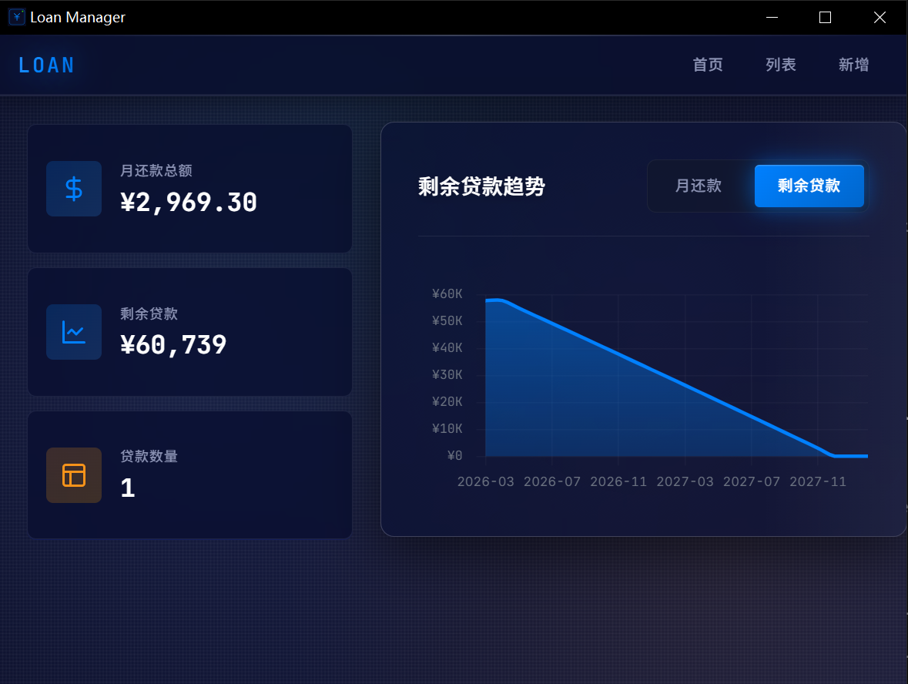

# 贷款管理系统

一个桌面贷款管理应用，支持多种还款方式计算和可视化展示。



## 功能特性

- 支持等额本息、等额本金、先息后本三种还款方式
- 贷款增删改查，支持提前还款记录
- 还款明细查看，可与银行对账
- 趋势图表展示未来 24 个月还款和余额变化
- 数据持久化存储（SQLite）

## 使用方法

### 直接运行

1. 下载 `loan-manager-wails.exe`
2. 双击运行
3. 数据库自动创建在 `C:\Users\<用户名>\.loan-manager\loans.db`

### 从源码构建

**前置要求**
- Go 1.21+
- Node.js 16+
- Wails CLI v2

**安装 Wails CLI**
```bash
go install github.com/wailsapp/wails/v2/cmd/wails@latest
```

**克隆并构建**
```bash
git clone <仓库地址>
cd loan-manager-wails
wails build
```

构建产物位于 `build/bin/` 目录。

## 还款方式说明

**等额本息**：每月还款金额固定，包含本金和利息

**等额本金**：每月偿还相同本金，利息逐月递减

**先息后本**：每月只还利息，到期一次性偿还本金

## 技术栈

- 后端：Go + GORM + SQLite
- 前端：Vue 3 + TypeScript + Chart.js
- 框架：Wails v2

## 许可证

MIT License
